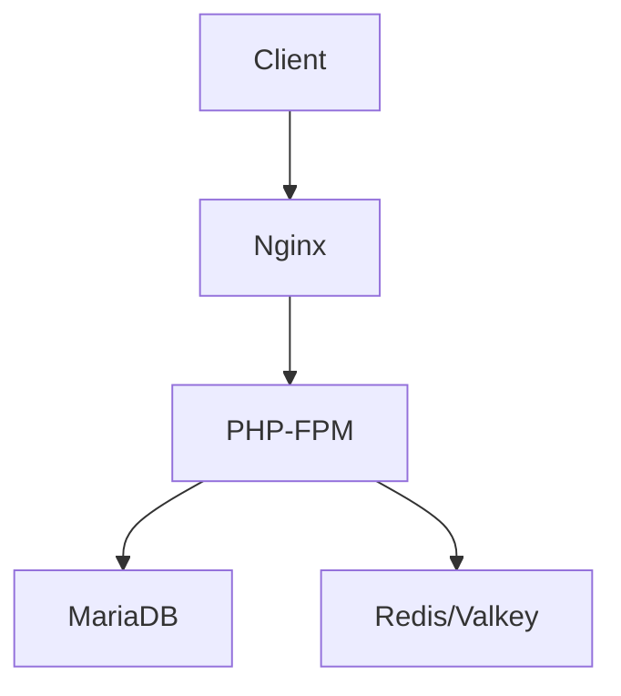

# Architecture Notes

## Architecture Notes

This project uses a containerized microservices architecture for deploying GLPI. The system separates concerns into distinct containers: PHP-FPM for application logic, Nginx for HTTP serving, MariaDB for persistence, and Redis/Valkey for caching.

## System Architecture Overview

The deployment follows a multi-container architecture with clear separation of concerns:

- **Web Layer**: Nginx reverse proxy serving static files and proxying PHP requests
- **Application Layer**: PHP-FPM running GLPI application code
- **Data Layer**: MariaDB for persistent storage
- **Cache Layer**: Redis/Valkey for session and data caching

Requests flow: Client → Nginx → PHP-FPM → MariaDB/Redis

## Architectural Layers

- **Web Tier**: Nginx reverse proxy (`docker/nginx/`)
- **Application Tier**: PHP-FPM with GLPI (`docker/php/`)
- **Data Tier**: MariaDB database
- **Cache Tier**: Redis/Valkey
- **Orchestration**: Docker Compose (dev) / Helm+Kubernetes (prod)

> See [`codebase-map.json`](./codebase-map.json) for complete symbol counts and dependency graphs.

## Detected Design Patterns

| Pattern | Confidence | Locations | Description |
|---------|------------|-----------|-------------|
| Multi-stage Build | 95% | `docker/nginx/Dockerfile` | Separates build and runtime stages |
| Sidecar Pattern | 90% | `docker/docker-compose.yml` | One-time init containers (db-install, verify-dir) |
| Reverse Proxy | 95% | `docker/nginx/` | Nginx proxies to PHP-FPM |
| Health Checks | 85% | `helm/templates/` | K8s liveness/readiness probes |
| PVC-based Persistence | 90% | `helm/templates/` | Persistent volumes for GLPI data |

## Entry Points

- `docker/docker-compose.yml` — Development orchestration
- `docker/docker-compose-build.yml` — Build-from-source orchestration
- `helm/Chart.yaml` — Kubernetes Helm chart

## Public API

| Symbol | Type | Location |
|--------|------|----------|
| `eftechcombr/glpi:base` | Docker Image | `docker/php/Dockerfile.base` |
| `eftechcombr/glpi:php-fpm-{VERSION}` | Docker Image | `docker/php/Dockerfile` |
| `eftechcombr/glpi:nginx-{VERSION}` | Docker Image | `docker/nginx/Dockerfile` |
| `glpi` Helm Chart | K8s Package | `helm/Chart.yaml` |

## External Service Dependencies

- **MariaDB**: Primary database, accessed via internal DNS
- **Redis/Valkey**: Caching layer, accessed via internal DNS
- **GLPI Release Downloads**: GitHub releases for application source

## Key Decisions & Trade-offs

- **Alpine-based images**: Smaller attack surface and image size
- **Non-root containers**: Security best practice for containerized apps
- **PVC-based persistence**: Enables stateful workloads in Kubernetes
- **Subchart dependencies**: Reuses battle-tested MariaDB and Valkey charts

## Diagrams

## Risks & Constraints

- PVC access mode (ReadWriteOnce) limits horizontal scaling
- GLPI requires shared storage for multi-replica deployments
- Database migrations must run as one-time jobs before app startup

## Top Directories Snapshot

- `docker/` — 17 files (Dockerfiles, compose, scripts)
- `helm/` — 23 files (chart, templates, subcharts)

## Related Resources

- [Project Overview](./project-overview.md)
- [Data Flow](./data-flow.md)
- [Helm README](./helm/README.md)
