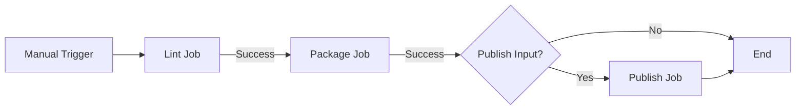

# Design Document

## Overview

This design implements an automated CI/CD pipeline for Helm chart management using GitHub Actions. The solution will validate, package, and publish the GLPI Helm chart to GitHub Pages, making it available as a public Helm repository. The workflow will support both continuous validation on pull requests and automated publishing on tagged releases.

## Architecture

### Workflow Triggers

The system uses two primary trigger patterns:

1. **Continuous Validation**: Triggered on push and pull_request events to any branch
   - Executes linting and validation
   - Does not publish charts
   - Provides fast feedback on chart quality

2. **Release Publishing**: Triggered on Git tags matching `v*.*.*` pattern
   - Executes full pipeline: lint, package, and publish
   - Updates the chart repository index
   - Deploys to GitHub Pages

### Publishing Strategy

The design uses GitHub Pages as the chart repository hosting solution because:
- Native GitHub integration with no external dependencies
- Free hosting for public repositories
- Automatic HTTPS support
- Simple authentication using GITHUB_TOKEN
- Standard Helm repository compatibility

## Components and Interfaces

### 1. Helm Chart Linting Job

**Purpose**: Validate Helm chart syntax, structure, and best practices

**Implementation**:
- Uses `helm/chart-testing-action` for comprehensive validation
- Runs `helm lint` to check for errors
- Validates Chart.yaml schema compliance
- Checks template rendering without errors

**Inputs**:
- Chart directory: `kubernetes/glpi`
- Helm version: 3.x (latest stable)

**Outputs**:
- Validation status (pass/fail)
- Detailed error messages if validation fails

**Error Handling**:
- Workflow fails immediately on linting errors
- Error messages displayed in GitHub Actions logs
- Pull requests blocked until linting passes

### 2. Helm Chart Packaging Job

**Purpose**: Create versioned .tgz archives of the Helm chart

**Implementation**:
- Uses `helm package` command
- Reads version from `Chart.yaml`
- Generates package in `.cr-release-packages/` directory
- Creates package filename: `glpi-{version}.tgz`

**Inputs**:
- Chart directory: `kubernetes/glpi`
- Chart.yaml version field

**Outputs**:
- Packaged chart: `glpi-{version}.tgz`
- Package stored as workflow artifact

**Dependencies**:
- Requires successful linting job completion
- Runs on every workflow execution

### 3. Chart Repository Publishing Job

**Purpose**: Publish packaged charts to GitHub Pages and maintain repository index

**Implementation**:
- Uses `helm/chart-releaser-action` for automated publishing
- Updates or creates `index.yaml` with new chart metadata
- Commits changes to `gh-pages` branch
- Maintains historical versions in the repository

**Inputs**:
- Packaged chart from packaging job
- Existing `index.yaml` from gh-pages branch (if exists)
- GitHub token for authentication

**Outputs**:
- Updated `index.yaml` with new chart entry
- Chart .tgz file published to gh-pages branch
- GitHub Pages site updated automatically

**Repository Index Structure**:
```yaml
apiVersion: v1
entries:
  glpi:
    - name: glpi
      version: 1.0.0
      appVersion: "11.0.2"
      description: GLPI - IT Asset Management and Service Desk
      urls:
        - https://{owner}.github.io/{repo}/glpi-1.0.0.tgz
      created: 2025-11-15T00:00:00.000000000Z
      digest: {sha256-hash}
```

**Dependencies**:
- Requires successful packaging job completion
- Only runs when publish input is true
- Requires GitHub Pages enabled in repository settings

### 4. Version Extraction Component

**Purpose**: Extract and display chart version for tracking and logging

**Implementation**:
- Reads version from Chart.yaml using `yq` or `grep`
- Displays version in workflow logs
- Used for package naming and release tracking

**Inputs**:
- Chart.yaml file content

**Outputs**:
- Chart version string
- Version logged for audit trail

**Error Handling**:
- Workflow fails if Chart.yaml is malformed or version is missing
- Clear error message guides user to fix Chart.yaml

## Data Models

### Workflow Configuration

```yaml
name: Helm Chart CI/CD
on:
  workflow_dispatch:
    inputs:
      publish:
        description: 'Publish chart to repository'
        required: false
        default: 'true'
        type: boolean

permissions:
  contents: write
  pages: write
  id-token: write

env:
  CHART_DIR: kubernetes/glpi
```

### Job Dependencies



### Chart Metadata

The Chart.yaml file serves as the source of truth for:
- Chart version (semantic versioning)
- Application version
- Chart description and metadata
- Dependencies (if any)

## Error Handling

### Linting Failures

**Scenario**: Helm chart contains syntax errors or violates best practices

**Handling**:
1. Workflow fails at lint job
2. Detailed error output displayed in logs
3. Subsequent jobs skipped
4. Pull request checks marked as failed

**User Action**: Fix chart errors and push new commit

### Chart.yaml Parsing Failures

**Scenario**: Chart.yaml is malformed or version field is missing

**Handling**:
1. Workflow fails at version extraction step
2. Error message indicates Chart.yaml issue
3. Publishing prevented

**User Action**: Fix Chart.yaml syntax and ensure version field is present

### Publishing Failures

**Scenario**: GitHub Pages deployment fails or index update fails

**Handling**:
1. Workflow fails at publish job
2. Chart package preserved as artifact
3. Previous repository state unchanged
4. Detailed error in logs

**User Action**: Check GitHub Pages settings, token permissions, or retry workflow

### Authentication Failures

**Scenario**: GITHUB_TOKEN lacks required permissions

**Handling**:
1. Workflow fails with permission error
2. Clear message about missing permissions

**User Action**: Verify workflow permissions in YAML configuration

## Testing Strategy

### Pre-Deployment Testing

1. **Workflow Syntax Validation**
   - Use `actionlint` to validate workflow YAML syntax
   - Check for deprecated actions or syntax

2. **Dry-Run Testing**
   - Test workflow on feature branch without publishing
   - Verify linting catches intentional errors
   - Confirm packaging produces valid .tgz files

3. **Manual Trigger Testing**
   - Test workflow dispatch with publish enabled
   - Test workflow dispatch with publish disabled (validation only)
   - Verify workflow can be triggered from different branches

### Post-Deployment Testing

1. **Chart Installation Testing**
   - Add published repository: `helm repo add glpi https://{owner}.github.io/{repo}`
   - Search for chart: `helm search repo glpi`
   - Install chart: `helm install test-glpi glpi/glpi`
   - Verify installation succeeds

2. **Repository Index Validation**
   - Verify index.yaml is accessible via HTTPS
   - Confirm chart metadata is correct
   - Check that multiple versions are listed (after multiple releases)

3. **End-to-End Release Testing**
   - Manually trigger workflow from main branch
   - Verify full pipeline executes
   - Confirm chart appears in repository
   - Test installation from published repository

### Manual Validation

1. **Pre-Merge Validation**
   - Run workflow with publish disabled on feature branches
   - Validate chart changes before merging
   - Prevents broken charts from reaching main branch

2. **Release Verification**
   - Each manual workflow run creates new chart version (when published)
   - Historical versions remain accessible
   - Index.yaml maintains complete version history

## Implementation Notes

### GitHub Pages Setup

Before the workflow can publish charts, GitHub Pages must be configured:
1. Repository Settings → Pages
2. Source: Deploy from a branch
3. Branch: `gh-pages` / `root`
4. GitHub Actions will create this branch automatically on first publish

### Token Permissions

The workflow uses `GITHUB_TOKEN` with these permissions:
- `contents: write` - Push to gh-pages branch
- `pages: write` - Deploy to GitHub Pages
- `id-token: write` - OIDC token for GitHub Pages deployment

### Chart Versioning Workflow

Recommended process for releasing new chart versions:
1. Update Chart.yaml version field
2. Commit changes to main branch
3. Navigate to Actions tab in GitHub
4. Select "Helm Chart CI/CD" workflow
5. Click "Run workflow" button
6. Ensure "Publish chart to repository" is checked
7. Click "Run workflow" to execute
8. Workflow validates, packages, and publishes new version

### Multiple Charts Support

While the current design focuses on the single `glpi` chart, the architecture supports multiple charts:
- Lint job can validate multiple chart directories
- Package job can iterate over multiple charts
- Index.yaml supports multiple chart entries
- Future enhancement: matrix strategy for parallel processing
